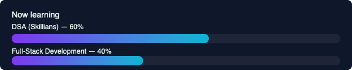

  

<h1 align="center">Hi 👋, I'm Mohammed C H</h1>
<h3 align="center">Tech Support • Data Analysis • Full-Stack Learner</h3>

  

  
  

[Resume (PDF)](./Mohammed_C_H_RL.pdf)

---

### 🔭 About
Technical Support & Data Analysis specialist — I build automation, dashboards and tooling that reduce manual effort and improve reporting. Currently mastering DSA (Skillians) and building Full-Stack projects.

---

### 🔥 Selected achievements
- Built JS automation tools that reduced manual workload by ~30%.  
- Built performance & finance dashboards improving reporting efficiency by ~40%.  
- Built a Flight Fare Prediction web app (Django + MySQL + Random Forest).  
- Interactive Power BI: Road Accident Analysis (2024).

---

### 🧭 Now learning

  

---

### 🛠 Tech Stack
Python · JavaScript · MySQL · Pandas · NumPy · Power BI · Tableau · Excel · Git

---

### ⭐ Featured Projects
- **Road-Accident-Analytics** — Power BI dashboards with story-driven pages.  
- **flight-fare-predictor** — Django + Random Forest fare predictor (demo & notebooks).  
- **ops-automation-scripts** — JS & Apps Script collection for ops automation.

---

### 📫 Contact
- Email: muhammedch069@gmail.com  
- LinkedIn: https://www.linkedin.com/in/mohammed-c-h/  
- Portfolio: https://mohammedch.onrender.com/

---
